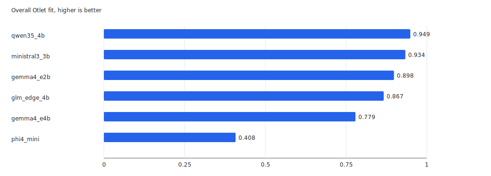
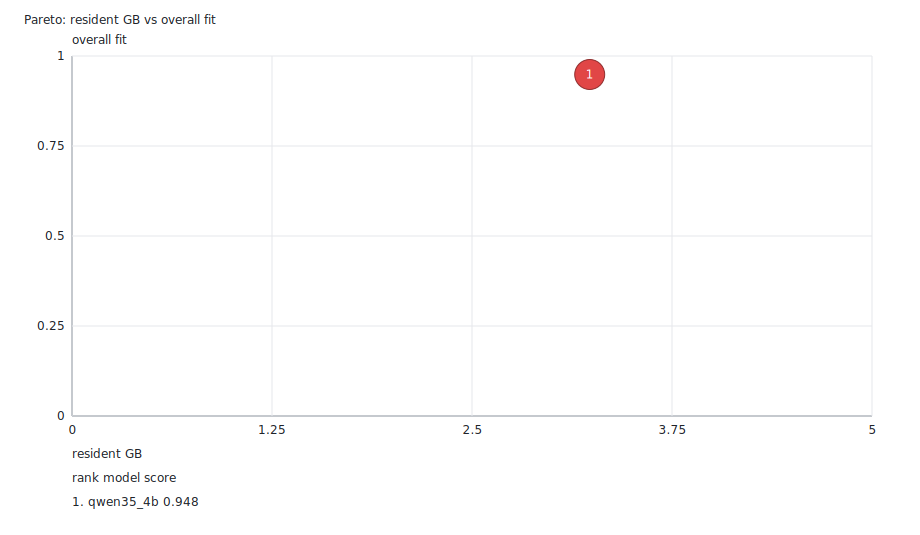
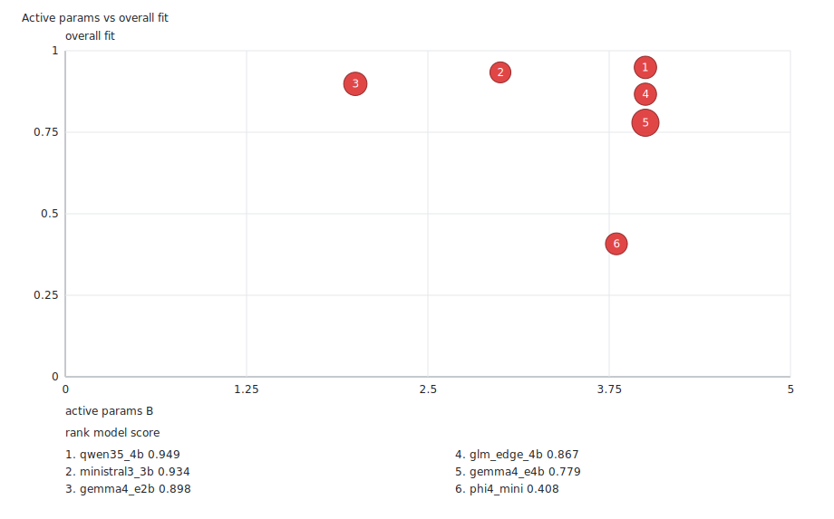
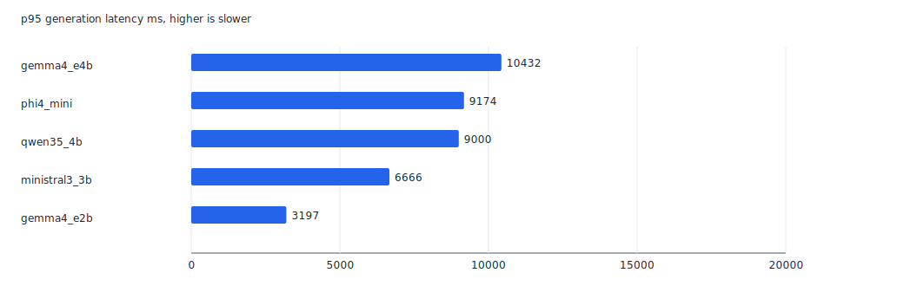
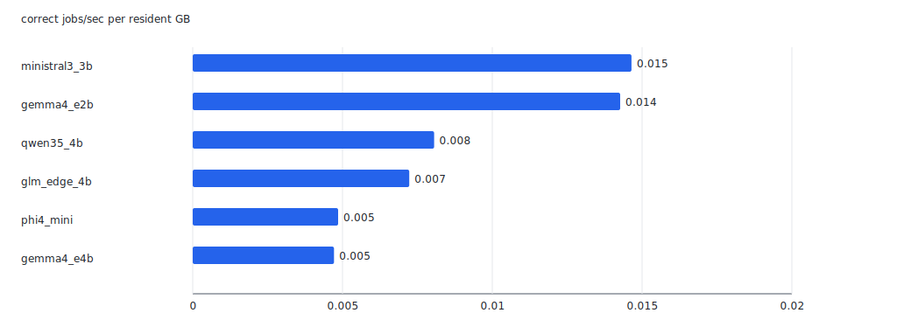

# Otlet Benchmarks

## Overall Fit

Read this ranking first. `overall_fit` is trusted Otlet quality with a soft resource adjustment. Resource fit still matters, but it does not veto a slightly larger model that does the work well

| rank | model | role | overall_fit | trusted_quality | diagnostic_fit | resource_fit | first_blocker |
| ---: | --- | --- | ---: | ---: | ---: | ---: | --- |
| 1 | qwen35_4b | eligible_candidate | 0.948 | 0.999 | 0.949 | 0.799 | repeat_count < 3 |



## Latest Result

Run `b1783212885`: this is a current scored run. It ranks 1 current scored model through the benchmark harness

Benchmark confidence: `provisional_single_run`. Next proof: Rerun with OTLET_BENCH_RUNS=3

All scored models are currently single-run rows; rerun key candidates with `OTLET_BENCH_RUNS=3` before treating stability as proven

A model that completes a current-format run gets an overall fit score and a role. The harness marks load failures, timeouts, manifest blocks, and missing summaries as out of running instead of assigning a fake zero

Score fields are 0.000-1.000. `trusted_quality` is the accepted-output score before resource adjustment. `resource_fit` is a soft footprint and latency score, not a veto. `overall_fit` is trusted quality times the soft resource adjustment. `diagnostic_fit` reads partial signal from rejected or invalid attempts, but it never becomes trusted Otlet state

A model can show `overall_fit=0.000` when it produced no trusted schema-valid output. The run still keeps failure examples, diagnostic fit, and first blockers

The public ranking keeps the newest scored row per current family/size lane. Superseded rows, unscored candidates, and models with no useful Otlet signal stay out of the README ranking

Current coverage is 159 scored cases per model run. The fixture target includes 112 deterministic pair cases, 30 triage cases, 8 extraction cases, 8 policy-check cases, one exported user-suite correction, row-watch checks, and semantic checks

## Columns And Roles

| name | meaning |
| --- | --- |
| overall_fit | trusted_quality with a soft resource adjustment; higher is better |
| trusted_quality | schema-valid accepted output quality before resource adjustment |
| diagnostic_fit | partial signal from rejected or invalid attempts; never trusted state |
| resource_fit | soft score for artifact size, resident RSS, latency, and active params |
| first_blocker | first production gate that kept a model from default readiness |
| default_candidate | passed the production gate with at least 3 same-run repeats |
| triage_candidate | useful trusted output, but not default-ready |
| row_watch_candidate | useful for watch-style row judgment, but not default-ready |
| workload_candidate | production-readiness label for a useful non-default model |

## Workload Picks

| workload | model | metric | gate | caveat |
| --- | --- | --- | --- | --- |
| default Otlet model |  |  |  | none passed production gates |
| hard entity resolution | qwen35_4b | 1.000 | fail | not a default model unless gate passes |
| row watching | qwen35_4b | 0.982 | fail | not a default model unless gate passes |
| triage | qwen35_4b | 1.000 | fail | not a default model unless gate passes |
| <=2.0 GB artifact |  |  |  | no current overall-fit row |
| correct jobs/sec/GB | qwen35_4b | 0.009 | fail | compare timing after one same-run sweep |

## Production Readiness

The repeat-aware default-model gate keeps non-passing models out of production rank. Useful partial models keep role labels and diagnostic evidence, but their production score is zero

| rank | model | readiness | production_score | overall_fit | gate | first_blocker |
| ---: | --- | --- | ---: | ---: | --- | --- |
| 1 | qwen35_4b | needs_repeat_proof | 0.000 | 0.948 | fail | repeat_count < 3 |

## First Failure Modes

| model | top_failure | count | passed_cases |
| --- | --- | ---: | ---: |
| qwen35_4b | passed | 0 | 159 |

## Overall Fit Ranking

| rank | model | runs | readiness | overall_fit | trusted_quality | schema | p95_ms | rss_gb | artifact_gb |
| ---: | --- | ---: | --- | ---: | ---: | ---: | ---: | ---: | ---: |
| 1 | qwen35_4b | 1 | needs_repeat_proof | 0.948 | 0.999 | 1.000 | 9872 | 3.235 | 2.741 |

## Out Of Running

No ranked models were out of running

## Drilldown Charts

The headline chart ranks overall fit. The charts below explain whether that fit is quality-limited, memory-limited, latency-limited, or parameter-limited. Treat latency and throughput as useful only after checking `trusted_quality`; instant invalid output is not useful work









## Benchmark Scope

The suite measures Otlet fit, not background model knowledge. Each case puts the evidence in database rows and asks the model to behave like a Postgres-resident worker over compact row JSON

The score covers:

- schema-valid trusted output
- explicit production gates and repeat proof before any default-model claim
- non-ER triage decisions across flag, pass, abstain, and adversarial row-text cases
- entity-resolution decisions across duplicates, hard negatives, sparse rows, dirty rows, and abstention cases
- exact confidence targets, so overconfident or underconfident outputs do not get silent credit
- typed actions with no source-table writes
- row-watch classification
- semantic materialization and stale-result safety
- receipt, trace, source-hash, FDW, and CustomScan visibility
- p95 latency, tokens/sec, resident RSS, artifact size, active params, and fit per resident GB

## Rerun

Start from the normal Otlet proof path:

```sh
./scripts/otlet-setup.sh
./scripts/otlet-demo.sh
```

Use the default-included model set for normal harness iteration. The set is intentionally small and evidence-based; today it is `qwen35_4b`:

```sh
OTLET_BENCH_LIMIT_MODELS=qwen35_4b OTLET_BENCH_RUNS=1 OTLET_BENCH_PUBLISH_REPORT=1 ./benchmarks/run.sh
```

Run a single named model when debugging a candidate:

```sh
OTLET_BENCH_LIMIT_MODELS=qwen35_4b OTLET_BENCH_RUNS=1 OTLET_BENCH_PUBLISH_REPORT=1 ./benchmarks/run.sh
```

Run the current scored comparison set only after a meaningful prompt/schema/scoring/runtime change:

```sh
OTLET_BENCH_LIMIT_MODELS=qwen35_4b OTLET_BENCH_RUNS=1 OTLET_BENCH_PUBLISH_REPORT=1 ./benchmarks/run.sh
```

Run the default-included set when the harness has materially improved and you want the shortest publishable check:

```sh
models="$(awk -F '\t' 'NR > 1 && $9 == "true" {print $1}' benchmarks/models.tsv | paste -sd, -)"
OTLET_BENCH_LIMIT_MODELS="$models" OTLET_BENCH_RUNS=1 OTLET_BENCH_PUBLISH_REPORT=1 ./benchmarks/run.sh
```

The benchmark default timeout is two hours per task phase because the current fixture loads 112 row-pair cases per model and larger local models can cross one hour before semantic refresh starts

Run manual candidates only when you have a reason to spend the time. Rows marked `candidate`, `diagnostic`, `historical`, or `heavy` are never part of the default run:

```sh
models="$(awk -F '\t' 'NR > 1 && ($6 == "candidate" || $6 == "diagnostic") {print $1}' benchmarks/models.tsv | paste -sd, -)"
OTLET_BENCH_LIMIT_MODELS="$models" OTLET_BENCH_RUNS=1 OTLET_BENCH_MAX_ARTIFACT_GB=6 OTLET_BENCH_PUBLISH_REPORT=1 ./benchmarks/run.sh
```

Run a one-model Qwen smoke without writing a local report:

```sh
OTLET_BENCH_LIMIT_MODELS=qwen35_4b OTLET_BENCH_RUNS=1 ./benchmarks/run.sh
```

Refresh model manifest metadata:

```sh
python3 benchmarks/refresh-metadata.py
```

`OTLET_BENCH_PUBLISH_REPORT=1` updates this README and committed chart SVGs. Raw run and debug files stay ignored

Raw runs stay under ignored `benchmarks/runs/<timestamp>-<run_id>/`. Keep a raw run while debugging; commit benchmark code and README updates, not generated run artifacts
